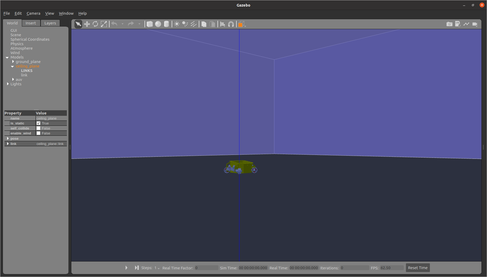

# calypso-sim

Ros noetic based autonomous underwatever drone simulator

## Setup

### REQUIREMENT

Tried and tested on ROS Noetic with Gazebo version 11
Make sure gazebo ros 

Git Clone the repo into the src folder of your workspace (Usually catkin_ws):
```bash
git clone https://github.com/Dreadnought-Robotics/calypso-sim
```

Compile it by:
```bash
catkin_make
```

#### Dependencies

joint state publisher : 
```bash 
sudo apt install ros-noetic-joint-state-publisher-gui
```

Controller Manager : 
```bash
sudo apt-get install ros-noetic-controller-manager
```

Joint state controller : 
```bash
sudo apt-get install ros-noetic-joint-state-controller
```

joint velocity controller : 
```bash
sudo apt-get install ros*controller*
```
(installs all the controllers will be updated with specific one later)

install gazebo ros control : 
```bash
sudo apt-get install ros-noetic-gazebo-ros-pkgs ros-noetic-gazebo-ros-control
```

## RESULTS

Gazebo sim launcher:
```bash
roslaunch calypso_sim blue.launch
```

Teleop Launcher:
```bash
roslaunch calypso_sim teleop.launch 
```

Command to look at all topic:
```bash
rostopic list
```



